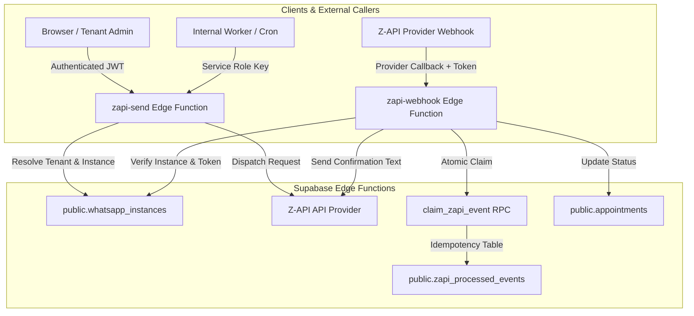

# BARBEX — PHASE 17C.M6F: Z-API WHATSAPP EDGE MIGRATION

## 1. Overview & Architecture

Phase 17C.M6F migrates all active WhatsApp messaging, outbound dispatching, and inbound webhook callbacks from the legacy Nitro backend / Lovable gateway to native Supabase Edge Functions with strict multi-tenant isolation, atomic idempotency, and full PII/secret protection.

---

## 2. Multi-Tenant Instance Model

Barbex implements a **Per-Tenant Instance Model (Model B)**:
- Every barbershop tenant maintains its own instance record in `public.whatsapp_instances`.
- `whatsapp_instances` fields: `tenant_id`, `instance_id`, `token`, `client_token`, `server_url`, `connected`, `status`, `webhook_token`.
- Outbound requests strictly derive the instance from the authenticated user's `tenant_id`. Client cannot specify arbitrary instance credentials.
- Inbound webhooks authenticate the provider using `client_token` header or `webhook_token` parameter, looking up the associated tenant securely.

---

## 3. Edge Functions Specification

### `zapi-send`
- **Location:** `supabase/functions/zapi-send/index.ts`
- **Authentication:** Bearer JWT for users (`tenant_admin`, `super_admin`, `barber`) or Service Role Key for internal workers.
- **Actions:**
  - `send-text`: Sends standard text message to validated customer or phone.
  - `send-button`: Sends interactive button message (with fallback to text options).
  - `send-image`: Sends image attachment with caption.
  - `send-test-message`: Diagnostics text send.
  - `send-test-button`: Diagnostics button send.
  - `check-status`: Syncs connection status from Z-API provider to `whatsapp_instances`.
  - `set-webhook`: Configures Z-API instance webhook endpoints.
  - `disconnect`: Disconnects instance.
  - `get-qrcode`: Retrieves QR code for pairing.
- **Abuse & Rate Limiting:** Enforces `checkRateLimit` on browser-facing dispatches.

### `zapi-webhook`
- **Location:** `supabase/functions/zapi-webhook/index.ts`
- **Configuration:** `verify_jwt = false` in `supabase/config.toml`.
- **Supported Events:**
  - `ReceivedCallback`: Handles incoming messages and interactive button responses (e.g., `buttonId === 'main_confirm'`), atomically confirming matching future appointments.
  - `DeliveryCallback` / `MessageStatusCallback`: Updates delivery records (`SENT`, `DELIVERED`, `READ`, `FAILED`).
  - `ConnectedCallback` / `DisconnectedCallback`: Updates instance connection state in `whatsapp_instances`.
  - Unsupported events: Safely acknowledged with HTTP 200 without mutating business records.
- **Idempotency:** Enforces deduplication via `claim_zapi_event` RPC and `public.zapi_processed_events`.

---

## 4. Database Migration & Security

- **Migration:** `supabase/migrations/20260904180000_phase17c_m6f_zapi_idempotency.sql`
- **Table:** `public.zapi_processed_events` with unique constraint on `event_id`.
- **RPC:** `public.claim_zapi_event(p_event_id, p_event_type, p_tenant_id, p_instance_id, p_source)`
  - `SECURITY DEFINER`
  - `SET search_path = public, pg_temp`
  - `REVOKE ALL FROM PUBLIC, anon, authenticated`
  - `GRANT EXECUTE TO service_role`

---

## 5. Security & Privacy Guarantees

1. **Zero Secret Leaks:** Token values and client tokens are masked (`3CB4...B10F`) across all integration logs.
2. **PII Masking:** Destination and sender phone numbers are redacted in logs (`+55 (**) *****-8888`).
3. **Cross-Tenant Prevention:** Tenant A cannot access, query, or dispatch messages using Tenant B's WhatsApp instance or send messages to Tenant B's customers by ID.
