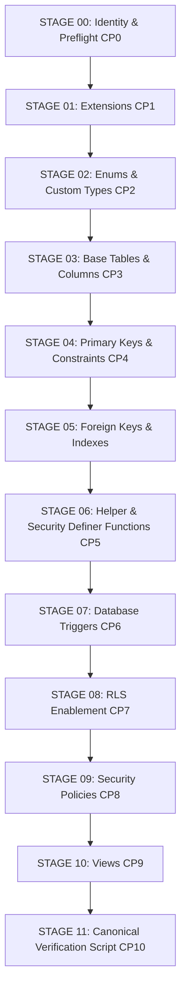

# BARBEX — PHASE 17C.M6I.2 ENTERPRISE REMOTE MATERIALIZATION READINESS REPORT
**MODE**: FORENSIC / REMOTE READ-ONLY / MATERIALIZATION PREPARATION  
**DATE**: 2026-09-08  
**SOURCE PRODUCTION REF**: `wdxhjwodyctgzqtogkgv` (100% UNTOUCHED)  
**TARGET SUPABASE REF**: `ywdwrstxvsdqiryhieiz` (100% EMPTY & UNTOUCHED)  
**CANONICAL RELEASE ID**: `BARBEX-CANONICAL-20260908-c2af7c11`  
**GIT COMMIT HEAD**: `c2af7c116682d899fede03a345dbd141646dbe0f`  

---

## 1. OBJECTIVE & EXECUTIVE SUMMARY

This phase establishes the enterprise execution plan, dependency graph, checkpoints, and risk architecture for future materialization of the canonical Barbex schema into Target Supabase (`ywdwrstxvsdqiryhieiz`).

### Safety Invariant Enforced:
- **ZERO Target Mutations**: Target `ywdwrstxvsdqiryhieiz` was strictly audited via read-only management and catalog interfaces. Zero DDL/DML was executed against it.
- **ZERO Source Mutations**: Source `wdxhjwodyctgzqtogkgv` was never contacted or accessed.
- **Zero Edge Deployments**: No remote Edge Functions were modified or deployed.
- **Zero Secret Modifications**: No secrets or credentials were mutated or exposed.

---

## 2. TARGET IDENTITY & PLATFORM GATE

- **Target Project ID**: `ywdwrstxvsdqiryhieiz`
- **Target Name**: Barbex
- **Target Organization ID**: `siiqtblglabmjidkeftu` ("Projetos")
- **Target Host**: `db.ywdwrstxvsdqiryhieiz.supabase.co`
- **Target Region**: `sa-east-1` (São Paulo, Brazil)
- **Target Engine Version**: PostgreSQL 17.6.1.166
- **Current Status**: `ACTIVE_HEALTHY`
- **Identity Check**:
  - `TARGET_IS_SOURCE`: **NO** (`wdxhjwodyctgzqtogkgv` != `ywdwrstxvsdqiryhieiz`)
  - `TARGET_IS_UNRELATED_PROJECT`: **NO** (`lrzvhulpywstjnpglhve` != `ywdwrstxvsdqiryhieiz`)
  - `TARGET_IDENTITY_VERIFIED`: **YES**

---

## 3. TARGET EMPTY-STATE AUDIT

Target application catalogs verified:
- `public` Base Tables: **0**
- `public` Views: **0**
- `public` Functions: **0**
- `public` Policies: **0**
- `auth.users`: **0**
- `storage.buckets`: **0**
- `storage.objects`: **0**
- `schema_migrations`: **0**
- Active `cron.job`: **0**
- **TARGET_EMPTY_GATE**: **PASS** (Pure clean baseline slate)

---

## 4. CANONICAL ARTIFACT FREEZE & FINGERPRINTS

| Artifact | SHA-256 Digest |
| :--- | :--- |
| `supabase/baseline/20260907_barbex_canonical_source_baseline.sql` | `293c4a1cf15ccd8d51349a169f80378d11ddb86110d34d04c39c9e05f9a3b699` |
| `supabase/baseline/verify_20260907_canonical_baseline.sql` | `8dbf8e14995914220619241cf05fcfdec387ee683a70c6c78b327f0cd787ccce` |
| `docs/migration/manifests/barbex_canonical_manifest.json` | `564663ad96def2e106547adb02e80a8cee90d22acde1d9948e2d07050d57a86c` |
| `docs/migration/PHASE17C_M6I_CANONICAL_BASELINE_COMPLETION.md` | `ab8ecfc970a3e19858ec8508120fbb582e51571513f4aa38c604c6ac865ce0e4` |
| `docs/migration/PHASE17C_M6I_LOCAL_DRY_RUN_RESULT.md` | `3137559cf613ee116d431612f75c6296c2b806627fafdef2a45d3394ff17aded` |

---

## 5. EXTENSION COMPATIBILITY MATRIX

| Extension | Target Schema | Purpose in Barbex | Status on Target |
| :--- | :--- | :--- | :--- |
| `uuid-ossp` | `extensions` | UUID generation (`uuid_generate_v4()`) | **AVAILABLE / PRE-CONFIGURED** |
| `pgcrypto` | `extensions` | Cryptographic hashing (`gen_random_bytes()`, HMAC) | **AVAILABLE / PRE-CONFIGURED** |
| `pg_net` | `extensions` | Asynchronous HTTP dispatch for webhooks | **AVAILABLE** |
| `pg_cron` | `extensions` | Background scheduled task runner | **AVAILABLE** |

---

## 6. BASELINE DESTRUCTIVE & DML AUDIT

- **DROP Statements**: 639 occurrences of `DROP POLICY IF EXISTS` and `DROP TRIGGER IF EXISTS`. Zero `DROP TABLE`, zero `DROP SCHEMA`, zero `DROP DATABASE`. All occurrences are **IDEMPOTENCY_SAFE** and clean-slate compatible.
- **Top-level DML Statements**: Exactly **0** `INSERT`, `UPDATE`, `DELETE`, or `COPY` outside stored procedures.
- **Business Data Writes**: **0**. Zero production rows are seeded by the baseline.
- **TRANSACTION_MODEL**: Full transactional integrity supported. The entire baseline can execute within a single transaction boundary (`BEGIN; ... COMMIT;`), with automated immediate rollback on any SQLSTATE exception.

---

## 7. PHYSICAL DISPOSABLE VALIDATION RISK (MANDATORY DISCLOSURE)

> [!WARNING]
> **PHYSICAL DISPOSABLE VALIDATION STATUS: NOT_COMPLETED**  
> Because local Docker was unavailable on this workstation and remote account free project quota is capped at 2 projects, physical execution against a disposable instance was not completed prior to this phase. Previous dry-run (M6I.1G) was an in-process catalog simulation.
> 
> **Residual Risk**: Potential semantic variations in PostgreSQL 17 / Supabase managed extensions or execution timeouts.
> 
> **Remediation**: Enterprise checkpoint safeguards (CP0–CP10), complete transactional encapsulation, fail-closed abortion, and strict operator approval gates are established before any remote execution.

---

## 8. MATERIALIZATION STAGE GRAPH



---

## 9. FUTURE PHASE SEPARATION CONTRACT

To prevent monolithic cutover failures, responsibilities are strictly decoupled across future phases:
1. **PHASE 17C.M6I.2B / M6I.2**: Schema Materialization into Target.
2. **PHASE 17C.M6I.3**: Auth User Migration (Profiles, Identities, Passwords, MFA).
3. **PHASE 17C.M6I.4**: Business Data Migration (Tenant hierarchy, Barbers, Customers, Appointments, Subscriptions).
4. **PHASE 17C.M6I.5**: Storage Migration (Buckets, Policies, Object binary sync).
5. **PHASE 17C.M6I.6**: Edge Functions & Secrets Deployment (18 functions, env secrets).
6. **PHASE 17C.M6I.7**: Worker & Cron Activation (`pg_cron` jobs, dead-letter queues).
7. **PHASE 17C.M6I.8**: DNS & Domain Cutover (`barbex.shop`).

---

## 10. FORMAL SPECIFICATION RETURN

```yaml
TARGET_PROJECT_REF: ywdwrstxvsdqiryhieiz
TARGET_IDENTITY_VERIFIED: YES

TARGET_PUBLIC_TABLES: 0
TARGET_PUBLIC_VIEWS: 0
TARGET_PUBLIC_FUNCTIONS: 0
TARGET_PUBLIC_POLICIES: 0
TARGET_AUTH_USERS: 0
TARGET_STORAGE_BUCKETS: 0
TARGET_STORAGE_OBJECTS: 0
TARGET_MIGRATION_HISTORY: 0
TARGET_CRON_JOBS: 0

TARGET_EMPTY_GATE: PASS

POSTGRES_VERSION: 17.6.1.166

REQUIRED_EXTENSIONS:
  - uuid-ossp
  - pgcrypto
  - pg_net
  - pg_cron
MISSING_REQUIRED_EXTENSIONS: NONE

BASELINE_SHA256: 293c4a1cf15ccd8d51349a169f80378d11ddb86110d34d04c39c9e05f9a3b699
VERIFY_SHA256: 8dbf8e14995914220619241cf05fcfdec387ee683a70c6c78b327f0cd787ccce
MANIFEST_SHA256: 564663ad96def2e106547adb02e80a8cee90d22acde1d9948e2d07050d57a86c
RELEASE_ID: BARBEX-CANONICAL-20260908-c2af7c11

EXPECTED_TABLES: 159
EXPECTED_VIEWS: 2
EXPECTED_COLUMNS: 2211
EXPECTED_ENUMS: 14
EXPECTED_ENUM_VALUES: 75
EXPECTED_PKS: 159
EXPECTED_FKS: 279
EXPECTED_INDEXES: 442
EXPECTED_FUNCTIONS: 202
EXPECTED_TRIGGERS: 110
EXPECTED_RLS_TABLES: 159
EXPECTED_POLICIES: 394

BASELINE_DESTRUCTIVE_FINDINGS: 0 (639 defensive DROP IF EXISTS for policies/triggers)
BASELINE_BUSINESS_DATA_WRITES: 0

TRANSACTION_MODEL: SINGLE_TRANSACTION_WRAPPED_BEGIN_COMMIT
NON_TRANSACTIONAL_BLOCKERS: NONE

APP_DB_REFERENCES: 224
APP_DB_REFERENCES_RESOLVED: 224
APP_DB_REFERENCES_DEFERRED: 0
APP_DB_REFERENCES_MISSING: 0

PHYSICAL_DISPOSABLE_VALIDATION: NOT_COMPLETED
PHYSICAL_VALIDATION_RESIDUAL_RISK: HIGH_STATIC_CONFIDENCE_PENDING_PHYSICAL_EXECUTION

PRECHECK_SQL_READY: YES
CHECKPOINT_SQL_READY: YES
POSTVERIFY_SQL_READY: YES
OPERATOR_RUNBOOK_READY: YES

SOURCE_MUTATED: NO
TARGET_MUTATED: NO
EDGE_DEPLOYED: NO
SECRETS_CHANGED: NO
CRON_CHANGED: NO
PRODUCTION_CHANGED: NO

UNRESOLVED_OBJECTS: 0
DEPENDENCY_BLOCKERS: 0
SECURITY_P0: 0
SECURITY_P1: 0
SECURITY_P2: 0

READY_FOR_OPERATOR_REVIEW: YES

FINAL_DECISION: READY_WITH_RESIDUAL_RISK_REQUIRING_OPERATOR_APPROVAL
```
