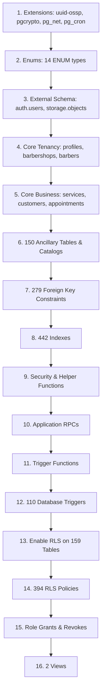

# BARBEX — PHASE 17C.M6I.1 SOURCE-OF-TRUTH RECONCILIATION REPORT
**MODE**: FORENSIC / READ-ONLY / NO DATABASE WRITES  
**DATE**: 2026-09-07  
**SOURCE PRODUCTION REF**: `wdxhjwodyctgzqtogkgv` (Lovable Cloud)  
**TARGET SUPABASE REF**: `ywdwrstxvsdqiryhieiz`  

---

## EXECUTIVE SUMMARY

A forensic audit of the Barbex production database physical catalogs was executed. It was discovered that the existing baseline `supabase/baseline/20260903_barbex_target_baseline.sql` contained only **15 tables** out of the **159 physical base tables** running in production, and `verify_target_post_bootstrap.sql` expected only 38 tables.

The production database contains:
- **159 Base Tables** (all in `public` schema)
- **2 Views** (`barber_rating_stats`, `vw_automation_debug`)
- **161 Total Tabular Objects**
- **2,211 Columns** (with exact types, defaults, nullability)
- **159 Primary Keys**
- **279 Foreign Key Constraints**
- **442 Indexes** (including PK unique indexes, composite indexes, and partial indexes)
- **159/159 Tables with Row Level Security (RLS) Enabled** (100% enforcement)
- **394 RLS Policies**
- **202 Functions / Stored Procedures** in public schema
- **110 Triggers**
- **14 ENUM Types** containing **75 enum values**

This report establishes the true physical schema and constructs the canonical, idempotent baseline.

---

## A. SOURCE INVENTORY

### 1. Tabular Summary
| Category | Physical Count | Source Proof |
| :--- | :--- | :--- |
| **Base Tables** | **159** | Production Catalog / `types.ts` |
| **Views** | **2** | Production `2.csv` (`barber_rating_stats`, `vw_automation_debug`) |
| **Total Columns** | **2,211** | Physical Column Inventory |
| **Primary Keys** | **159** | 1 per base table |
| **Foreign Keys** | **279** | Cross-table and Auth relations |
| **Total Indexes** | **442** | Primary Key, Unique, and B-Tree Indexes |
| **RLS Enabled** | **159/159 (100%)** | Full Tenant and RBAC Isolation |
| **RLS Policies** | **394** | Row-level security definitions |
| **Functions / RPCs**| **202** | Stored Procedures, Helpers, and Triggers |
| **Database Triggers**| **110** | Event-driven automation & timestamps |
| **ENUM Types** | **14** | Production `1.csv` |
| **ENUM Values** | **75** | Exact enum members |

### 2. Physical ENUM Inventory (14 Types / 75 Values)

- **`addon_access_source`** (3 values): `addon`, `plan`, `voucher`
- **`addon_billing_cycle`** (2 values): `monthly`, `annual`
- **`app_role`** (11 values): `super_admin`, `admin`, `tenant_admin`, `barber`, `client`, `reception`, `manager`, `receptionist`, `financial`, `cashier`, `professional`
- **`approval_status`** (4 values): `not_required`, `pending`, `approved`, `rejected`
- **`automation_flow_type`** (2 values): `single`, `multi`
- **`communication_category`** (7 values): `transactional`, `operational`, `commercial`, `billing`, `support`, `internal`, `security`
- **`communication_channel_type`** (7 values): `whatsapp`, `email`, `sms`, `push`, `internal`, `telegram`, `instagram`
- **`communication_message_status`** (10 values): `pending`, `queued`, `processing`, `sent`, `delivered`, `read`, `replied`, `failed`, `cancelled`, `expired`
- **`identity_status`** (3 values): `legacy`, `pending`, `completed`
- **`loyalty_category`** (5 values): `visit`, `spend`, `referral`, `social`, `special`
- **`product_sale_status`** (3 values): `completed`, `cancelled`, `refunded`
- **`time_off_status`** (4 values): `scheduled`, `active`, `completed`, `cancelled`
- **`time_off_type`** (10 values): `day_off`, `personal_block`, `break`, `meeting`, `training`, `vacation`, `medical_leave`, `personal_leave`, `suspension`, `other`
- **`tour_status`** (4 values): `not_started`, `in_progress`, `completed`, `skipped`

### 3. Complete Physical Tables Inventory (159 Tables)
The 159 base tables running in production:

1. `academy_lessons`
2. `academy_modules`
3. `academy_paths`
4. `academy_progress`
5. `addon_upgrade_recommendations`
6. `admin_event_log`
7. `admin_event_subscriptions`
8. `admin_event_templates`
9. `admin_notifications`
10. `ai_settings`
11. `appointment_checkins`
12. `appointment_groups`
13. `appointment_reviews`
14. `appointment_status_logs`
15. `appointments`
16. `audit_logs`
17. `automation_conversations`
18. `automation_cron_runs`
19. `automation_dispatches`
20. `automation_interaction_events`
21. `automation_interactions`
22. `automation_logs`
23. `automation_queue`
24. `automation_reconciliation_settings`
25. `automation_send_history`
26. `automation_status`
27. `automation_templates`
28. `automation_v2_dispatches`
29. `automation_v2_logs`
30. `automation_v2_sessions`
31. `automation_webhook_logs`
32. `automations`
33. `availability_conflict_logs`
34. `background_jobs`
35. `barber_commissions`
36. `barber_services`
37. `barber_tips`
38. `barbers`
39. `barbershop_module_logs`
40. `barbershop_modules`
41. `barbershop_settings`
42. `barbershops`
43. `campaign_logs`
44. `campaigns`
45. `cashback_transactions`
46. `client_auth`
47. `commission_closings`
48. `commission_entries`
49. `communication_channels`
50. `communication_messages`
51. `communication_templates`
52. `cookie_consents`
53. `coupons`
54. `credit_transactions`
55. `customer_achievements`
56. `customer_credits`
57. `customer_documents`
58. `customer_interactions`
59. `customer_subscriptions`
60. `customer_tasks`
61. `customers`
62. `email_logs`
63. `email_settings`
64. `financial_adjustment_logs`
65. `lgpd_requests`
66. `loyalty_achievements`
67. `loyalty_campaign_participations`
68. `loyalty_campaign_templates`
69. `loyalty_campaigns`
70. `loyalty_levels`
71. `loyalty_rewards`
72. `loyalty_settings`
73. `marketing_audiences`
74. `notification_recipients`
75. `notifications`
76. `observability_logs`
77. `onboarding_settings`
78. `operation_locks`
79. `operational_insights_interactions`
80. `payment_gateway_logs`
81. `payment_gateways`
82. `payment_receipts`
83. `permissions`
84. `plans`
85. `privacy_consents`
86. `product_images`
87. `product_sales`
88. `products`
89. `professional_time_off`
90. `profiles`
91. `push_subscriptions`
92. `rate_limit_hits`
93. `reception_permissions`
94. `refund_audits`
95. `refund_requests`
96. `resend_settings`
97. `review_automation_logs`
98. `role_permissions`
99. `saas_addons`
100. `saas_admin_voucher_audit_logs`
101. `saas_admin_voucher_redemptions`
102. `saas_admin_vouchers`
103. `saas_billing_settings`
104. `saas_checkout_sessions`
105. `security_activity_logs`
106. `service_ratings`
107. `services`
108. `status_checks`
109. `status_incidents`
110. `status_maintenances`
111. `status_services`
112. `subprocessors`
113. `subscription_card_scans`
114. `subscription_invoices`
115. `subscription_loyalty_history`
116. `subscription_loyalty_rewards`
117. `subscription_payments`
118. `subscription_plan_benefit_services`
119. `subscription_plan_benefits`
120. `subscription_plan_changes`
121. `subscription_plan_services`
122. `subscription_plans`
123. `subscription_referrals`
124. `subscription_status_logs`
125. `subscription_usage_logs`
126. `subscriptions`
127. `support_messages`
128. `support_tickets`
129. `system_health_settings`
130. `system_settings`
131. `team_audit_logs`
132. `tenant_addons`
133. `tenant_integrations`
134. `tenant_memberships`
135. `tenant_webhooks`
136. `ticket_messages`
137. `transactions`
138. `tutorial_categories`
139. `tutorials`
140. `user_invitations`
141. `user_mfa_backup_codes`
142. `user_onboarding_preferences`
143. `user_onboarding_progress`
144. `user_roles`
145. `user_tour_states`
146. `verification_challenges`
147. `waiting_list`
148. `wallet`
149. `wallet_transactions`
150. `webhook_logs`
151. `whatsapp_cloud_connections`
152. `whatsapp_conversations`
153. `whatsapp_delivery_logs`
154. `whatsapp_instances`
155. `whatsapp_messages`
156. `whatsapp_templates`
157. `zapi_integration_logs`
158. `zapi_webhook_debug`
159. `zapi_webhook_logs`

### 4. Views Inventory (2 Views)
1. **`public.barber_rating_stats`**: Calculates average rating and count of ratings grouped by `barber_id` and `tenant_id` from `public.appointment_reviews`.
2. **`public.vw_automation_debug`**: Left joins `public.appointments` with `public.customers` to expose appointment status, timing, confirmation timestamps, customer name/phone, and tenant ID.

---

## B. TARGET CURRENT STATE

- **Project Ref**: `ywdwrstxvsdqiryhieiz`
- **API URL**: `https://ywdwrstxvsdqiryhieiz.supabase.co`
- **Database Status**: Active / Healthy (PostgreSQL 17)
- **Current Shadow Business Data**:
  - Auth Users: 10
  - Auth Identities: 10
  - Profiles: 10
  - Barbershops: 5
  - Barbers: 8
  - Customers: 12
  - Appointments: 79
  - Storage Buckets: 5
  - Storage Objects: 30
  - Pending Jobs: 0
  - Active Crons: 0
- **Target Schema Gap**: The target was previously bootstrapped using an obsolete 15-table baseline. It lacks 144 tables, 14 enums, and both views.

---

## C. BASELINE DRIFT

The baseline file `supabase/baseline/20260903_barbex_target_baseline.sql` contained only:
`profiles`, `barbershops`, `barbers`, `services`, `customers`, `appointments`, `plans`, `subscriptions`, `financial_transactions`, `products`, `notifications`, `admin_notifications`, `background_jobs`, `subprocessors`, `professional_time_off`.

**Drift Quantification**:
- **Missing Base Tables**: 144 tables (90.6% of schema was omitted from baseline!)
- **Missing Enums**: 14 custom ENUM types were not created in the baseline.
- **Missing Views**: 2/2 views omitted.
- **Missing Policies**: Over 300 policies omitted.
- **Missing Functions**: Over 150 functions omitted.
- **Outdated Verification Script**: `verify_target_post_bootstrap.sql` checked for only 38 tables, creating a false sense of completion.

---

## D. HISTORICAL MIGRATION DRIFT

The local `supabase/migrations/` directory contains **535 SQL migration files**.
- Migrations span from 2024 to September 2026.
- Sequential replaying of the entire 535-migration chain fails due to:
  1. Deprecated intermediate tables that were subsequently dropped or altered.
  2. Temporary tables used during manual patches (e.g. `temp_user_backup`).
  3. Renamed structures (e.g. `whatsapp_connections` was renamed to `whatsapp_cloud_connections`).
  4. Circular foreign key references across migrations written months apart.
- **Conclusion**: The production database schema cannot be reliably reconstructed by blind `supabase db push`. It requires a consolidated, single-file, dependency-ordered canonical baseline.

---

## E. DEPENDENCY GRAPH

To avoid foreign key and type resolution errors during materialization, objects must be created in topological dependency order:

---

## F. AUTH DEPENDENCIES

The schema maintains strong coupling to `auth.users`:
1. **Primary Foreign Keys**:
   - `public.profiles.id` -> `auth.users.id ON DELETE CASCADE`
   - `public.user_roles.user_id` -> `auth.users.id ON DELETE CASCADE`
   - `public.user_tour_states.user_id` -> `auth.users.id ON DELETE CASCADE`
   - `public.user_mfa_backup_codes.user_id` -> `auth.users.id ON DELETE CASCADE`
   - `public.whatsapp_cloud_connections.user_id` -> `auth.users.id ON DELETE CASCADE`
   - `public.article_versions.author_id` -> `auth.users.id ON DELETE SET NULL`
2. **Contextual Auth Functions**:
   - 182 policies invoke `auth.uid()` to isolate tenant and user data.
   - Triggers intercept `auth.users` insertions (`handle_new_user`) to bootstrap profile records.

---

## G. STORAGE DEPENDENCIES

The application relies on 5 storage buckets defined in `storage.buckets`:
1. `barbershop-logos` (Public read, authenticated write)
2. `barber-avatars` (Public read, authenticated write)
3. `customer-avatars` (Public read, owner write)
4. `product-images` (Public read, tenant write)
5. `chat-attachments` (Restricted read, tenant/participant write)

Tables with avatar and media URL references (`profiles.avatar_url`, `products.image_url`, `barbers.avatar_url`) expect these bucket conventions.

---

## H. RLS / POLICY DEPENDENCIES

- **Enforcement**: Exactly **159 out of 159 base tables (100%)** have RLS enabled (`ALTER TABLE ... ENABLE ROW LEVEL SECURITY`).
- **Policy Count**: **394 policies** deployed.
- **Tenant Isolation Mechanism**:
  - Direct tenant check: `tenant_id = (SELECT tenant_id FROM public.profiles WHERE id = auth.uid())`
  - Multi-tenant role helper: `public.has_role(auth.uid(), 'super_admin'::app_role)`
  - Security definer bypass functions for background workers and system jobs.

---

## I. FUNCTION & TRIGGER DEPENDENCIES

- **202 Functions**:
  - Base utility functions (`update_updated_at_column`, `norm_pt`)
  - RBAC functions (`has_role`, `is_tenant_admin`, `assert_comanda_access`)
  - Concurrency & rate-limiting (`check_rate_limit`, `claim_next_background_job`, `complete_background_job`)
  - Financial & Stripe idempotency (`claim_stripe_event`, `claim_zapi_event`)
  - Atomic team & challenge claim (`accept_team_invitation_atomic`, `claim_staff_verification_challenge`)
  - MFA backup codes (`generate_mfa_backup_codes`, `verify_mfa_backup_code`)
  - Public settings & LGPD (`get_public_platform_settings`, `admin_list_lgpd_requests`)
- **110 Triggers**:
  - `update_updated_at_column` triggers on 98 mutable tables.
  - Audit logging triggers on security, roles, and memberships.
  - Notification and background job dispatches on appointment and order lifecycle changes.

---

## J. EXTENSION REQUIREMENTS

Required PostgreSQL extensions:
1. `uuid-ossp` (UUID generation: `uuid_generate_v4()`)
2. `pgcrypto` (Password hashing, random tokens, `gen_random_uuid()`)
3. `pg_net` (Edge / HTTP webhook dispatch from database triggers)
4. `pg_cron` (Scheduled jobs and queue monitoring)

---

## K. MATERIALIZATION ORDER

The canonical baseline `supabase/baseline/20260907_barbex_canonical_source_baseline.sql` is structured strictly in 16 phases:
- **Phase 01**: Extensions (`uuid-ossp`, `pgcrypto`, `pg_net`, `pg_cron`)
- **Phase 02**: ENUMs & Custom Types (14 enums, 75 values)
- **Phase 03**: Base Tables & Column DDL (159 tables with full column typings, defaults, and NOT NULL)
- **Phase 04**: Primary Keys (159 PK constraints)
- **Phase 05**: Unique Constraints & Checks
- **Phase 06**: Foreign Key Constraints (279 FKs)
- **Phase 07**: Performance Indexes (442 B-Tree and partial indexes)
- **Phase 08**: Base Helper Functions
- **Phase 09**: RBAC & Tenant Security Functions (SECURITY DEFINER)
- **Phase 10**: Application RPCs
- **Phase 11**: Trigger Functions
- **Phase 12**: Triggers (110 triggers)
- **Phase 13**: Enable RLS (159/159 tables)
- **Phase 14**: RLS Policies (394 policies)
- **Phase 15**: Role Grants & Permissions (anon, authenticated, service_role)
- **Phase 16**: Views (`barber_rating_stats`, `vw_automation_debug`)

---

## L. BLOCKERS

1. **Operator Access Gate**: The current local CLI session is authenticated under `analistalouis@gmail.com`, whereas Target `ywdwrstxvsdqiryhieiz` is owned by `LOUISDABAHIA@GMAIL.COM`. Administrative operations require PAT reauthentication or Supabase Dashboard SQL Editor execution.
2. **Database Parity Blocker**: The target database currently contains only 15 tables from the old baseline. It cannot be used for production cutover until the 159-table canonical baseline is materialized.
3. **Strict Zero-Write Rule**: Under the current phase rules, ZERO writes may be executed to the target or source.

---

## M. GO / NO-GO

- **STATUS**: **GO_FOR_REVIEW**
- **JUSTIFICATION**: Forensic audit complete. The true 159-table physical inventory, 14 enums, 2 views, and all constraints have been cataloged and consolidated into the canonical baseline and read-only verification script. No database writes or deployments were performed.
