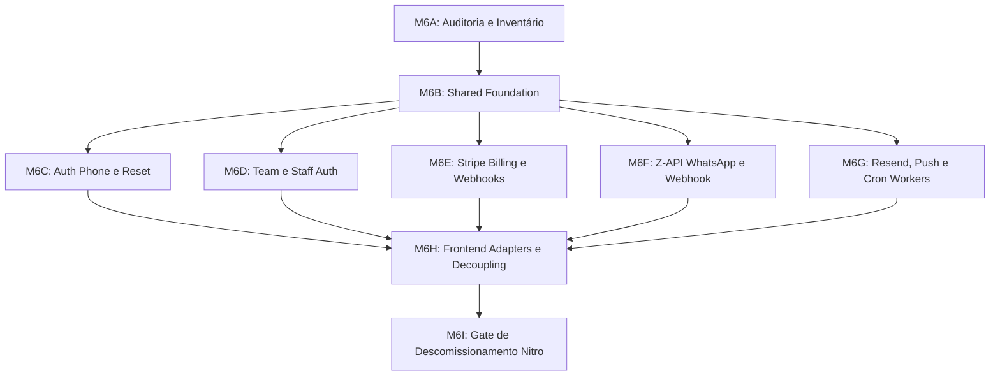

# BARBEX — PHASE 17C.M6 CUTOVER & DEPLOYMENT WAVES
## ROTEIRO DETALHADO DE MIGRAÇÃO POR ONDAS & CRITÉRIOS DE DESCOMISSIONAMENTO

Este documento define o sequenciamento técnico das ondas de implementação das Supabase Edge Functions e a substituição progressiva do runtime Nitro até o corte final.

---

### 1. Ondas de Implementação da Fase M6

#### Onda M6B: Shared Edge Foundation
- Criação dos módulos compartilhados em `supabase/functions/_shared/`.
- Padronização de CORS, rate limiting distribuído atômico via PostgreSQL RPC, validação Zod e sanitização de DTOs de erro.

#### Onda M6C: Autenticação por Telefone & Reset
- Implementação de `auth-phone` e `auth-phone-reset`.
- Suporte unificado para barbeiros e clientes com anti-enumeração de usuários e rate limit estrito.

#### Onda M6D: Gestão de Equipe & Staff Auth
- Implementação de `team-invitations` e `staff-auth`.
- Integração segura com Resend para envio de convites e GoTrue Admin para vinculação de credenciais.

#### Onda M6E: Stripe Checkout, Assinaturas & Webhooks
- Implementação de `stripe-checkout`, `stripe-addons` e `stripe-webhook`.
- Garantia de idempotência estrita via tabela `stripe_processed_events` com chave única `event_id`.

#### Onda M6F: Z-API Mensageria & Webhooks
- Implementação de `zapi-webhook` e `zapi-send`.
- Resolução multi-tenant estrita por número de instância e validação de `Client-Token`.

#### Onda M6G: Web Push, Resend Email & Cron Workers
- Implementação de `send-email`, `send-push` e `cron-worker`.
- Integração com `pg_cron` e `pg_net` para execução assíncrona desacoplada do runtime web.

#### Onda M6H: Adapters do Frontend (`src/lib/backend/`)
- Criação de adaptadores tipados no frontend que chamam diretamente o Supabase Client ou as Edge Functions via `supabase.functions.invoke()`.
- Remoção das importações de `createServerFn` nos componentes de UI.

#### Onda M6I: Gate de Descomissionamento do Backend Nitro
- Auditoria final de fechamento provando que o frontend não possui nenhuma chamada ativa para o servidor Nitro.
- Remoção definitiva de `SUPABASE_SERVICE_ROLE_KEY` e secrets de integração das variáveis da Cloudflare.

---

### 2. Critérios de Aceitação para Descomissionamento Total

| Critério | Meta Exigida | Status Atual | Status Alvo M6I |
|---|---|---|---|
| Chamadores Ativos de `createServerFn` | **0** | 97 | **0** |
| Rotas `/api/*` dependentes de Nitro | **0** | 12 | **0** |
| `SUPABASE_SERVICE_ROLE_KEY` no deploy web | **0** | Ativa | **0** |
| `STRIPE_SECRET_KEY` no deploy web | **0** | Ativa | **0** |
| `RESEND_API_KEY` no deploy web | **0** | Ativa | **0** |
| `ZAPI_TOKEN` no deploy web | **0** | Ativa | **0** |
| Webhooks apontando para Edge Functions | **100%** | 0% | **100%** |
| Testes Automatizados no Target Shadow | **100% PASS** | Mapeados | **100% PASS** |
